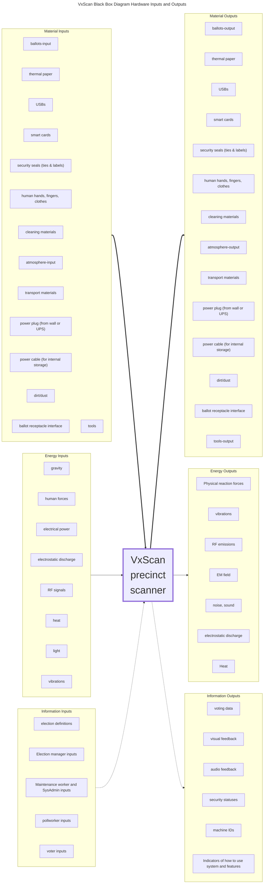

# VxScan 4.0 Black box diagram 
*Hardware only*

```mermaid

---
title: VxScan Black Box Diagram Hardware Inputs and Outputs
---

flowchart LR

    system["VxScan 
        precinct 
        scanner"]
    classDef box font-size:32pt,stroke-width:5px,text-align:center;
    class system box;


    subgraph inputMaterial["Material Inputs"]
        ballots-input ~~~
        thermalPaper-input["thermal paper"] ~~~
        usbs-input["USBs"] ~~~
        smartCards-input["smart cards"] ~~~
        securitySeals-input["security seals (ties & labels)"] ~~~
        hands-input["human hands, fingers, clothes"] ~~~
        cleaningMaterials-input["cleaning materials"] ~~~
        atmosphere-input ~~~
        transportMaterials-input["transport materials"] ~~~
        powerPlug-input["power plug (from wall or UPS)"] ~~~
        powerCable-input["power cable (for internal storage)"] ~~~
        dirt-input["dirt/dust"] ~~~
        ballotReceptacle-input["ballot receptacle interface"]
        tools
    end

    subgraph inputEnergy["Energy Inputs"]
        gravity ~~~
        humanForces["human forces"] ~~~
        electricalPower["electrical power"] ~~~
        esd["electrostatic discharge"] ~~~
        rf["RF signals"] ~~~
        heat ~~~
        light ~~~
        vibrations
    end

    subgraph inputInformation["Information Inputs"]
        electionDefinition["election definitions"] ~~~
        electionManager["Election manager inputs"] ~~~
        maintenanceWorker["Maintenance worker and SysAdmin inputs"] ~~~
        pollworker["pollworker inputs"] ~~~
        voter["voter inputs"]
    end

    inputMaterial==>system
    inputEnergy-->system
    inputInformation-.->system

    subgraph outputMaterial["Material Outputs"]
        ballots-output ~~~
        thermalPaper-output["thermal paper"] ~~~
        usbs-output["USBs"] ~~~
        smartCards-output["smart cards"] ~~~
        securitySeals-output["security seals (ties & labels)"] ~~~
        hands-output["human hands, fingers, clothes"] ~~~
        cleaningMaterials-output["cleaning materials"] ~~~
        atmosphere-output ~~~
        transportMaterials-output["transport materials"] ~~~
        powerPlug-output["power plug (from wall or UPS)"] ~~~
        powerCable-output["power cable (for internal storage)"] ~~~
        dirt-output["dirt/dust"] ~~~
        ballotReceptacle-output["ballot receptacle interface"] ~~~
        tools-output
    end

    subgraph outputEnergy["Energy Outputs"]
        physicalReactionForces["Physical reaction forces"] ~~~ 
        vibrations-output["vibrations"] ~~~
        rf-output["RF emissions"] ~~~
        emField-output["EM field"] ~~~
        noise["noise, sound"] ~~~
        esd-output["electrostatic discharge"] ~~~
        Heat
    end

    subgraph outputInformation["Information Outputs"]
        votingData["voting data"] ~~~
        visualFeedback["visual feedback"] ~~~
        audioFeedback["audio feedback"] ~~~
        securityStatuses["security statuses"] ~~~
        machineIds["machine IDs"] ~~~
        indicatorsHowToUse["Indicators of how to use system and features"]
    end

    system==>outputMaterial
    system-->outputEnergy
    system-.->outputInformation


```
