# Functional diagram: System-level (physical hardware only, all details)

The functions in this diagram correspond roughly with a separate list of functions (and failure modes) that we should prepare for in our designs. Finally, these functions correspond to our Engineering Design Requirements, which in turn correspond with 
the Voluntary Voting System Guidelines (VVSG 2.0).

<!-- Nodes in this Mermaid.js diagram are named according to important functions, inputs, and outputs in this system.
f = function
i = input
o = output 
s = function from another system outside the scanner
The numbers in the node name correspond with the VotingWorks dFMEA document as of February 2024.
Each block of nodes and connections represent roughly a functional chain for one type of major input and output.
-->

```mermaid

---
title: Functional Diagram of VxScan Precinct Scanner Hardware
---

flowchart LR

    subgraph paperPath["Paper Path"]
        %% function chain: accepted ballots 
        i1.00("ballot 
            (all types)")
        f1.00["Accept ballot"]
        f1.01["Align and direct ballot"]
        f1.02["Detect ballot presence
            before scanning"]
        f3.00["Scan ballot"]
        f2.01["Redirect accepted ballot"]
        f2.02["Release accepted ballot"]
        o2.02("accepted ballot")
        s1{{"Receive accepted ballot 
            into Ballot Receptacle"}}
        i1.00 ==> f1.00 ===> f1.01 ===> f1.02 ==> f3.00 ==> f2.01 ==> f2.02 ==> o2.02 ==> s1
        f1.00 -.-> o1.00("indicator of where
            to insert ballot")
        i1.01("gravity") --> f1.01
        i2.02("gravity") --> f2.02
        f3.00 --> o3.00a("noise, vibration, heat,
            ESD, RF, EMI")
        f3.00 ==> o3.00b("paper dust")

        %% function chain: rejected ballots
        f2.03["Redirect rejected ballot"]
        f2.04["Hold rejected ballot"]
        f2.05["Release rejected ballot 
            back to user"]
        o2.05("rejected ballot")
        f3.00 ===> f2.03 ==> f2.04 ==> f2.05 ==> o2.05
        i2.04("gravity") --> f2.04
        f2.04 -.-> o2.04("indicator of where
            to get rejected ballot")

        %% function chain: jammed ballots
        f2.06["Detect jammed ballot"]
        f2.07["Hold jammed ballot"]
        f2.08["Expose jammed ballot 
            for removal"]
        f2.09["Release jammed ballot"]
        o2.09("jammed ballot")
        f3.00 ==> f2.06 ==> f2.07 ===> f2.08 ==> f2.09 ==> o2.09
        i2.07("gravity") --> f2.07
        f2.07 -.-> o2.07("indicator of where
            to get jammed ballot")
        i2.08b("hand") <==> f2.08
        i2.08a("human forces") --> f2.08
        i2.09b("hand") <==> f2.09
        i2.09a("human forces") --> f2.09
    end

    %% function tree: electrical power
    subgraph electricalPower["Electrical Power"]
        s2{{"Transmit stable
            electrical power from
            Universal Power Supply 
            (UPS)"}}
        i22.01("electrical power")
        f22.01["Accept electrical 
            power"]
        s2 --> i22.01 --> f22.01

        i22.02("power cable")
        f22.02["Accept power 
            cable plug"]
        i22.02b("hand") <==> f22.02
        i22.02a("human pushing 
            force") --> f22.02
        s2 <==> i22.02 ==> f22.02 ==> f22.01

        f22.05["Release power 
            cable plug"]
        f22.02 ==> f22.05 ==> i22.02
        i22.05b("hand") <==> f22.05
        i22.05a("human pulling 
            force") --> f22.05

        f22.03["Transmit and protect
            electrical power"]
        f22.03 --> o22.03("RF, EMI")
        f22.01 ---> f22.03

        f17.05["Relieve strain on 
            electrical connections"]
        f17.05 --> f22.03

        f17.03["Secure wiring connections 
            mechanically in place"]
        f17.03 --> f22.03

        i17.06("RF, EMI")
        f17.06["Dissipate RF and EMI 
            from environment"]
        i17.06 --> f17.06 --> f22.03

        f17.02["Insulate and shield internal 
            wiring and electronics"] 
        f17.02 --> f22.03
        f17.02 -.-> o17.02["cable identifiers, 
            colors, textures"]

        f17.07["Reduce RF and EMI 
            from internal sources"]
        f22.03 --> f17.07
    end

    subgraph digitalInteractions["Digital Interactions"]
        f22.04["Control electrical 
            system (CPU)"]
        f22.04 --> o22.04("heat, RF, EMI")
        f22.03 --> f22.04
        f22.03 --> f1.02 & f3.00 
        f6.01["Display and direct 
            visual information"]
        f6.02["Synchronize visual 
            and audio information"]
        f6.03["Play and direct
            audio information"]
        f6.02 -.-> f6.01 & f6.03
        f24.01["Restrict access to data to
            specific users and roles"]
        f22.04 -.-> f24.01 -.-> f6.02
        f22.04 --> f6.01 & f6.03
        f6.01 -.-> o6.01("screen output")
        f6.03 -.-> o6.03("audio output")

        %% function tree: touch input
        f7.02["Receive tactile feedback 
            and forces from touch"]
        i7.02a("hand") <==> f7.02
        i7.02b("human pushing force") --> f7.02
        f7.02 -.-> f22.04
        f22.03 --> f7.02        
    end

    subgraph storage["Physical Storage"]
        %% function tree: power cable storage
        f28.01["Accept whole power 
            cable for storage"]
        f28.02["Secure and store
            power cable"]
        f28.03["Release power cable
            from storage"]
        f28.01 ==> f28.02 ==> f28.03

    %%    f28.04["Expose internal storage area"]
    %%    f28.04 --> f28.01
    %%    f28.05["Hide internal storage area"]
    %%    f28.03 --> f28.05

        %% function tree: storage of whole system
        f14.02["Shield from ESD 
            in storage"]
        f14.03["Protect from environmental 
            heat in storage"]
        f14.04["Protect from environmental 
            cold in storage"]
        f14.05["Collapse and close 
            the system"]
        f14.06["Expand and open 
            the system"]
        f14.05 <----> f14.06
        f14.05 --> f14.02 & f14.03 & f14.04

        i14.05a("hand") <==> f14.05
        i14.05b("human forces") --> f14.05
        i14.06a("hand") <==> f14.06
        i14.06b("human forces") --> f14.06

    end

    %% function tree: administrative access
    subgraph administrativeAccess["Administrative Access"]
        %% access door
        f14.01["Hide adminstrative interaction 
            features when system not in use"]
        f14.08["Expose administrative interaction 
            features when needed"]
        i14.01a("hand") <==> f14.01
        i14.01b("human forces") --> f14.01
        i14.08a("hand") <==> f14.08
        i14.08b("human forces") --> f14.08
        f14.01 --> f14.05
        f14.06 ---------> f14.08 --> f14.01
        
        subgraph printing["Printing Reports"]
            %% thermal printer and reports
            i9.01("thermal paper")
            f9.01["Accept thermal paper"]
            f9.02["Print on thermal paper"]
            f9.03["Hold report printed 
                on thermal paper"]
            f9.04["Release report printed
                on thermal paper"]
            o9.04("printed report")
            f9.01 -.-> o9.01("indicator of where
                to insert thermal paper")
            i9.01 ==> f9.01 ==> f9.02 ==> f9.03 ==> f9.04 ==> o9.04
            i9.01a("hand") <==> f9.01
            i9.01b("human force, 
                gravity") --> f9.01
            f9.02 --> o9.02("noise, vibration, heat,
                ESD, RF, EMI")
            f9.03 -.-> o9.03("indicator of where
                to retrieve report")
        end

        f14.08 --> f9.01
        f9.04 --> f14.01
        f22.03 ----------> f9.02


        subgraph dataStorage["Data Storage"]
            %% data storage device (USB sticks)
            i5.01a("data storage 
                device (USB stick)")
            f5.01["Accept data storage 
                device (USB stick)"]
            f5.02["Secure data storage 
                device (USB stick)"]
            f5.03["Read data from and 
                write data to data storage 
                device (USB stick)"]
            f5.04["Release data storage 
                device (USB stick)"]
            o5.04("data storage
                device (USB stick)")
            i5.04("human pulling force") --> f5.04
            i5.01a ==> f5.01 ==> f5.02 ==> f5.03 ==> f5.04 ==> o5.04
            f5.03 --> o5.03("noise, vibration, heat,
                ESD, RF, EMI")
            i5.01b("human pushing force") --> f5.01
            f5.01 -.-> o5.01("indicator of where
                to insert USB stick")
        end

        dataStorage --> f14.01
        f14.08 --> dataStorage
        f22.03 --------> f5.03


        subgraph accessControl["Access Control"]
            %% smart card
            i8.01a("smart card for user 
                role verification")
            f8.01["Accept smart cards"]
            f8.02["Secure card"]
            f8.03["Read card"]
            f8.04["Release card"]
            o8.04("smart card")
            i8.01a ==> f8.01 ==> f8.02 ==> f8.03 ==> f8.04 ==> o8.04
            i8.01b("human pushing force") --> f8.01
            f8.01 -.-> o8.01("indicator of where
                to insert smart card")
        end

        f14.08 --> f8.01
        f8.04 --> f14.01
        f22.03 ----------> f8.03

        %% security tie
        subgraph securityTieAccessPanel["Security Tie Point"]
            i24.02.1("security tie")
            f24.02.1["Accept security tie"]
            i24.01a.1("hand/tool") <==> f24.02.1
            i24.01b.1("human force") --> f24.02.1 
            f24.03.1["Hold security tie 
                in place"]
            f24.04.1["Release security tie"]
            o24.04.1("security tie")
            i24.02.1 ==> f24.02.1 ==> f24.03.1 ==> f24.04.1 ==> o24.04.1
            i24.04a.1("hand/tool") <==> f24.04.1
            i24.04b.1("human force") --> f24.04.1 
            f24.04.1 -.-> o24.04.1b("evidence of tampering
                with security tie or tie point")
            class i24.02.1,o24.04.1,i24.01a.1,i24.04a.1 ioMaterials;
            class i24.01b.1,i24.04b.1 ioEnergy;
            class o24.04.1b ioInformation;
        end

        f14.01 --> f24.02.1
        f24.04.1 --> f14.08

    end


    %% flows: expand system, then allow administrative actions, scanning...
    f14.06 --> f28.01 & f28.03
    f14.06 --> f1.00
    %% flows: power cable to/from storage
    i22.02 ===> f28.01
    f28.03 ===> i22.02


    %% function tree: heat transfer
    subgraph cooling["Cooling System"]
        f26.01["Absorb and transfer heat"]
        f26.02["Release heat"]
        f26.02 --> o26.02("heat")
        f26.01 --> f26.02
        %% absorb heat from different components
        f22.04 --> f26.01
        f22.03 & f9.02 & f5.03 & f8.03-------> f26.01
    end

    subgraph stability["Connection to Ballot Receptacle"]
        i16.01("interface to 
            ballot box")
        f16.01["Accept interface to 
            ballot box"]
        f16.02["Secure interface to 
            ballot box"]
        f16.03["Release interface to 
            ballot box"]
        o16.03("interface to
            ballot box")
        i16.01 ==> f16.01 ==> f16.02 ==> f16.03 ==> o16.03
        f16.07["Transfer forces and 
            torque to ballot box"]
        f7.03 --> f16.07
        f16.07 --> o16.07("forces and torque 
            to ballot box")
        f16.02 ==> f16.07
        f7.03["Resist force, torque, 
            and motion"]
        f7.02 --------> f7.03
        f16.02 ====> f24.02.2
        f16.05["Prevent outside materials 
            from entering at interface of 
            scanner and ballot box"]
        f16.02 ==> f16.05
        f24.04.2 ==> f16.03
        f16.06["Conduct ESD to 
            ballot receptacle"]
        f16.02 --> f16.06 --> o16.06
        f16.02 ==> f2.02

        %% security tie
        subgraph securityTieBallotReceptacle["Security Tie Point"]
            i24.02.2("security tie")
            f24.02.2["Accept security tie"]
            i24.01a.2("hand/tool") <==> f24.02.2
            i24.01b.2("human force") --> f24.02.2
            f24.03.2["Hold security tie 
                in place"]
            f24.04.2["Release security tie"]
            o24.04.2("security tie")
            i24.02.2 ==> f24.02.2 ==> f24.03.2 ==> f24.04.2 ==> o24.04.2
            i24.04a.2("hand/tool") <==> f24.04.2
            i24.04b.2("human force") --> f24.04.2 
            f24.04.2 -.-> o24.04.2b("evidence of tampering
                with security tie or tie point")
            class i24.02.2,o24.04.2,i24.01a.2,i24.04a.2 ioMaterials;
            class i24.01b.2,i24.04b.2 ioEnergy;
            class o24.04.2b ioInformation;
        end

    end

    %% arrange groups of functions
%%    electricalPower~~~digitalInteractions~~~paperPath
%%    storage~~~electricalPower
%%    dataStorage~~~accessControl~~~printing
    f14.01~~~securityTieAccessPanel~~~f14.08

    %% selected key information flows to/from CPU (not all of them)
    f22.04 <-....-> f3.00
    f5.03 <-...-> f22.04
    f8.03 -...-> f22.04
    f22.04 -..-> f9.02
%%    accessControl -.-> f22.04
%%   printing <-.-> f22.04
%%   dataStorage <-.-> f22.04


    %% styling
    classDef ioMaterials font-size:10pt,stroke-width:0px,fill-opacity:0,text-align:center,color:blue;
    classDef ioEnergy font-size:10pt,stroke-width:0px,fill-opacity:0,text-align:center,color:red;
    classDef ioInformation font-size:10pt,stroke-width:0px,fill-opacity:0,text-align:center,color:green;    
    classDef system font-size:14pt,stroke-width:3px,text-align:center;
    classDef subsubsystem fill:lightblue,fill-opacity:0.3,stroke-width:1px;
    classDef security fill:orange,fill-opacity:0.3;
    class i1.00,o2.02,o2.05,o2.09,i2.08b,i2.09b,i22.02,o3.00b,i22.02a,i22.05a,i14.01a,i14.08a,i14.05a,i14.06a,i9.01a,o9.04,i9.01,i5.01a,o5.04,i8.01a,o8.04,i7.02a,i16.01,o16.03 ioMaterials;
    class i1.01,i2.02,i2.04,i2.07,i2.08a,i2.09a,i22.01,o3.00a,o22.03,o22.04,i22.02b,i22.05b,i14.01b,i14.08b,i14.05b,i14.06b,i9.01b,o9.02,o5.03,i5.01b,i5.04,i8.01b,o26.02,i7.02b,o16.07,o16.06,i17.06 ioEnergy;
    class o1.00,o2.04,o2.07,o6.01,o6.03,o9.01,o9.03,o5.01,o8.01,o17.02 ioInformation;
    class s1,s2 system;
    class printing,dataStorage,accessControl subsubsystem;
    class securityTieAccessPanel,securityTieBallotReceptacle security;
    


```

