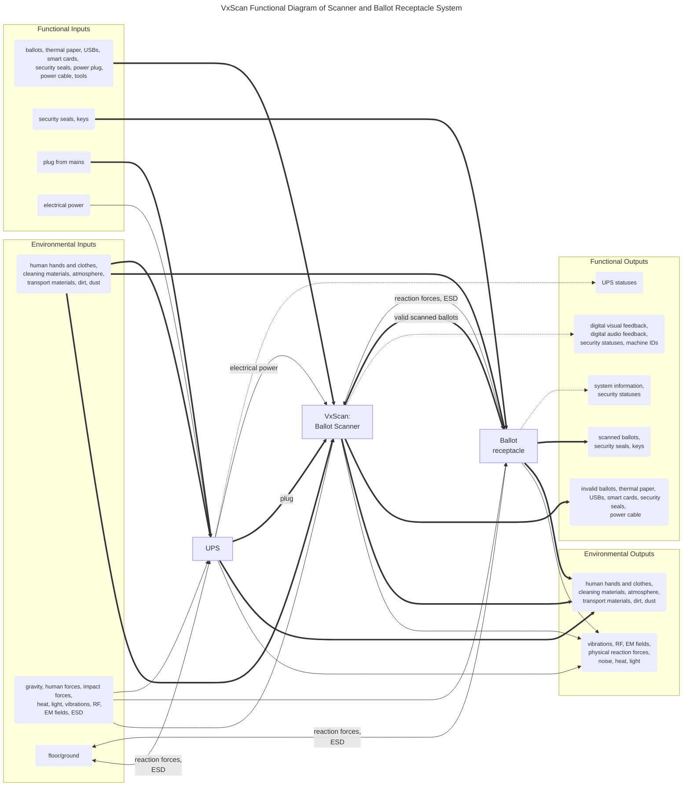

# VxScan 4.0 Functional Diagram of Scanner and Ballot Receptacle System, Focusing on Inputs and Outputs

```mermaid

---
title: VxScan Functional Diagram of Scanner and Ballot Receptacle System
---

flowchart LR

    scanner["VxScan: 
        Ballot Scanner"]
    ballotReceptacle["Ballot 
        receptacle"]
    ups["UPS"]

    inputsMaterialsCommon("human hands and clothes, 
        cleaning materials, atmosphere,
        transport materials, dirt, dust")
    inputsMaterialsCommon ==> scanner & ballotReceptacle & ups

    outputsEnergyCommon("vibrations, RF, EM fields, 
        physical reaction forces, 
        noise, heat, light")
    scanner & ballotReceptacle & ups --> outputsEnergyCommon

    outputsMaterialsCommon("human hands and clothes, 
        cleaning materials, atmosphere,
        transport materials, dirt, dust")
    scanner & ballotReceptacle & ups ==> outputsMaterialsCommon

    inputsMaterialScanner("ballots, thermal paper, USBs, smart cards, 
        security seals, power plug, power cable, tools")
    inputsMaterialScanner ===> scanner

    inputsEnergyCommon("gravity, human forces, impact forces,
        heat, light, vibrations, RF, EM fields, ESD")
    inputsEnergyCommon --> scanner & ballotReceptacle & ups

    outputsMaterialScanner("invalid ballots, thermal paper, 
        USBs, smart cards, security seals, 
        power cable")
    scanner ==> outputsMaterialScanner

    outputsInformationScanner("digital visual feedback,
        digital audio feedback,
        security statuses, machine IDs")
    scanner -.-> outputsInformationScanner

    scanner ===> |"valid scanned ballots"|ballotReceptacle
    scanner <--> |"reaction forces, ESD"|ballotReceptacle

    inputsMaterialsBallotReceptacle("security seals, keys")
    inputsMaterialsBallotReceptacle ==> ballotReceptacle

    outputsMaterialsBallotReceptacle("scanned ballots, 
        security seals, keys")
    ballotReceptacle ==> outputsMaterialsBallotReceptacle

    outputsInformationBallotReceptacle("system information, 
        security statuses")
    ballotReceptacle -.-> outputsInformationBallotReceptacle

    ups ==> |"plug"|scanner
    ups --> |"electrical power"|scanner

    outputsInformationUps("UPS statuses")
    ups -.-> outputsInformationUps

    inputsMaterialsUps("plug from mains")
    inputsMaterialsUps ==> ups
    inputsEnergyUps("electrical power")
    inputsEnergyUps --> ups

    floor["floor/ground"] 
    floor <--> |"reaction forces, 
        ESD"|ups
    floor <--> |"reaction forces, 
        ESD"|ballotReceptacle

    classDef io font-size:10pt,stroke-width:0px;
    class inputsEnergyCommon,inputsMaterialScanner,inputsEnergyCommon,outputsMaterialScanner,outputsMaterialsCommon,outputsEnergyCommon,inputsMaterialsBallotReceptacle,outputsInformationScanner,outputsMaterialsBallotReceptacle,outputsInformationBallotReceptacle,inputsEnergyBallotReceptacle,inputsMaterialsCommon,outputsInformationUps,inputsEnergyUps,inputsMaterialsUps,floor io;

    subgraph inputsFunctional["Functional Inputs"]
        inputsMaterialScanner
        inputsMaterialsBallotReceptacle
        inputsEnergyUps
        inputsMaterialsUps
    end

    subgraph inputsEnvironmental["Environmental Inputs"]
        inputsMaterialsCommon
        inputsEnergyCommon
        floor
    end


    subgraph outputsFunctional["Functional Outputs"]
        outputsMaterialScanner
        outputsInformationScanner
        outputsMaterialsBallotReceptacle
        outputsInformationBallotReceptacle
        outputsInformationUps
    end

    subgraph outputsEnvironmental["Environmental Outputs"]
        outputsMaterialsCommon
        outputsEnergyCommon
    end


```
