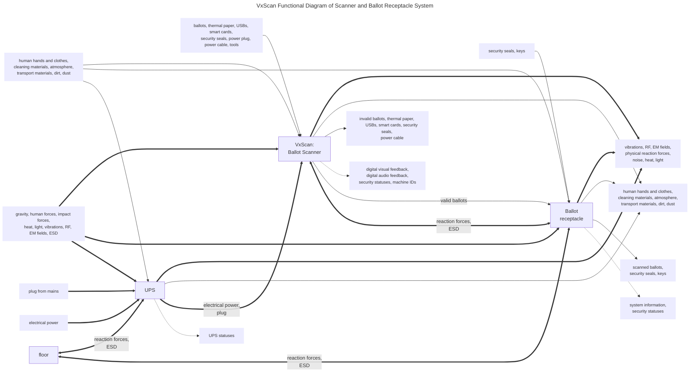

# VxScan 4.0 Functional Diagram of Scanner and Ballot Receptacle System

```mermaid

---
title: VxScan Functional Diagram of Scanner and Ballot Receptacle System
---

flowchart LR

    scanner["VxScan: 
        Ballot Scanner"]
    ballotReceptacle["Ballot 
        receptacle"]
    ups["UPS"]
    floor 

    inputsMaterialsCommon["human hands and clothes, 
        cleaning materials, atmosphere,
        transport materials, dirt, dust"]
    inputsMaterialsCommon-->scanner & ballotReceptacle & ups

    outputsEnergyCommon["vibrations, RF, EM fields, 
        physical reaction forces, 
        noise, heat, light"]
    scanner & ballotReceptacle & ups==>outputsEnergyCommon

    outputsMaterialsCommon["human hands and clothes, 
        cleaning materials, atmosphere,
        transport materials, dirt, dust"]
    scanner & ballotReceptacle & ups-->outputsMaterialsCommon

    inputsMaterialScanner["ballots, thermal paper, USBs, smart cards, 
        security seals, power plug, power cable, tools"]
    inputsMaterialScanner-->scanner

    inputsEnergyCommon["gravity, human forces, impact forces,
        heat, light, vibrations, RF, EM fields, ESD"]
    inputsEnergyCommon==>scanner & ballotReceptacle & ups

    outputsMaterialScanner["invalid ballots, thermal paper, 
        USBs, smart cards, security seals, 
        power cable"]
    scanner-->outputsMaterialScanner

    outputsInformationScanner["digital visual feedback,
        digital audio feedback,
        security statuses, machine IDs"]
    scanner-.->outputsInformationScanner

    scanner---->|"valid ballots"|ballotReceptacle
    scanner<==>|"reaction forces, 
        ESD"|ballotReceptacle

    inputsMaterialsBallotReceptacle["security seals, keys"]
    inputsMaterialsBallotReceptacle-->ballotReceptacle

    outputsMaterialsBallotReceptacle["scanned ballots, 
        security seals, keys"]
    ballotReceptacle-->outputsMaterialsBallotReceptacle

    outputsInformationBallotReceptacle["system information, 
        security statuses"]
    ballotReceptacle-.->outputsInformationBallotReceptacle

    ups===>|"electrical power, 
        plug"|scanner

    outputsInformationUps["UPS statuses"]
    ups-.->outputsInformationUps

    inputsMaterialsUps["plug from mains"]
    inputsMaterialsUps==>ups
    inputsEnergyUps["electrical power"]
    inputsEnergyUps==>ups

    floor<==>|"reaction forces, 
        ESD"|ups
    floor<==>|"reaction forces, 
        ESD"|ballotReceptacle

    classDef io font-size:10pt,stroke-width:0px;
    class inputsEnergyCommon,inputsMaterialScanner,inputsEnergyCommon,outputsMaterialScanner,outputsMaterialsCommon,outputsEnergyCommon,inputsMaterialsBallotReceptacle,outputsInformationScanner,outputsMaterialsBallotReceptacle,outputsInformationBallotReceptacle,inputsEnergyBallotReceptacle,inputsMaterialsCommon,outputsInformationUps,inputsEnergyUps,inputsMaterialsUps io;


```
