# System Diagram: Scanner subsystems and inputs/outputs

This diagram represents key subsystems or modules inside the VxScan.  Each subsystem is treated like a black box, and the flows of inputs and outputs are shown.

```mermaid

---
title: VxScan System Diagram of Main Subsystems
---

flowchart LR

    %% paper path
    paperPath["Paper Path 
        Subsystem"]
    i1.00("ballot 
        (all types)")
    o2.02("accepted ballot")
    i1.00 ==> paperPath
    paperPath ===> o2.02
    paperPath -.-> o1.00("indicator of where
        to insert ballot")
    i1.01("gravity") --> paperPath
    paperPath --> o3.00a("noise, vibration, heat,
        ESD, RF, EMI")
    paperPath ==> o3.00b("paper dust")
    paperPath -.-> o3.00c("indicator or alert
        of ballot status")        
    paperPath ==> o2.05("rejected ballot")
    paperPath -.-> o2.04("indicator of where
        to get rejected ballot")
    paperPath ==> o2.09("jammed ballot")
    paperPath -.-> o2.07("indicator of where
        to get jammed ballot")
    i2.08b("hand") <==> paperPath
    i2.08a("human forces") --> paperPath
    s1{{"Ballot Receptacle"}}
    o2.02 ==> s1

    %% electrical power
    electricalPower["Electrical Power 
        Subsystem"]
    s2{{"Universal Power Supply 
        (UPS)"}}
    i22.01("electrical power")
    s2 --> i22.01 ---> electricalPower
    i22.02("power cable")
    i22.02b("hand") <==> electricalPower
    i22.02a("human force") ---> electricalPower
    s2 <==> i22.02 ==> electricalPower
    electricalPower -.-> o17.02["cable identifiers, 
        colors, textures"]
    i17.06("RF, EMI")
    i17.06 --> electricalPower
    electricalPower --> o17.07("RF, EMI")
    electricalPower -->|"electricity"| paperPath

    %% digital interactions
    digitalInteractions["Digital Interactions
        Subsystem"]
    digitalInteractions --> o22.04("heat, RF, EMI")
    digitalInteractions -.-> o6.01("screen output")
    digitalInteractions -.-> o6.03("audio output")
    digitalInteractions -.-> o22.04b("alerts of system 
        malfunctions, tampering")
    electricalPower --->|"electricity"| digitalInteractions
    i7.02a("hand") <==> digitalInteractions
    i7.02b("human pushing force") --> digitalInteractions
    digitalInteractions <-...->|"scanner control data"| paperPath

    %% storage and transport
    storage["Storage and Transport
        Subsystem"]
    storage <=====> i22.02
    i14.05a("hand") <==> storage
    i14.05b("human forces") --> storage
    i15.02("gravity") --> storage
    o15.12("kinetic energy, 
        motion of system")
    storage --> o15.12
    i15.11("packaging material")
    i15.11 <==> storage
    i15.07("impact force, 
        gravity, weight")
    o15.07a("noise")
    o15.07b("debris")
    i15.07 --> storage --> o15.07a
    storage ==> o15.07b 
    i15.08("friction, horizontal forces")
    i15.08 --> storage
    
    %% administrative access
    administrativeAccess["Administrative Access
        Subsystem"]
    electricalPower -->|"electricity"| administrativeAccess
    digitalInteractions <-..->|"election and security data"| administrativeAccess
    i14.01a("hand, tool") <==> administrativeAccess
    i14.01b("human forces") --> administrativeAccess
    i9.01("thermal paper")
    o9.04("printed report")
    administrativeAccess -.-> o9.01("indicator of where
        to insert thermal paper")
    i9.01 ==> administrativeAccess ==> o9.04
    i9.01b("gravity") --> administrativeAccess
    administrativeAccess--> o9.02("noise, vibration, heat,
        ESD, RF, EMI")
    administrativeAccess -.-> o9.03("indicator of where
        to retrieve report")
    i5.01a("data storage 
        device (USB stick)")
    o5.04("data storage
        device (USB stick)")
    i5.01a ==> administrativeAccess ==> o5.04
    administrativeAccess -.-> o5.01("indicator of where
        to insert USB stick")
    i8.01a("smart card for user 
        role verification")
    o8.04("smart card")
    i8.01a ==> administrativeAccess ==> o8.04
    administrativeAccess -.-> o8.01("indicator of where
        to insert smart card")
    i24.02.1("security tie")
    o24.04.1("security tie")
    i24.02.1 ==> administrativeAccess ==> o24.04.1
    administrativeAccess -.-> o24.04.1b("evidence of tampering
        with security tie or tie point")
    class i24.02.1,o24.04.1,i24.01a.1,i24.04a.1 ioMaterials;
    class i24.01b.1,i24.04b.1 ioEnergy;
    class o24.04.1b ioInformation;

    %% stability
    stability["Connection to Ballot Receptacle"]
    stability -->|"forces, vibration,ESD"| s1
    stability --->|"forces"| storage
    stability <-->|"forces,vibration,ESD"| paperPath
    i16.01("interface to 
        ballot box")
    o16.03("interface to
        ballot box")
    i16.01 ==> stability ==> o16.03
    i24.02.2("security tie")
    i24.01a.2("hand/tool") <==> stability
    i24.01b.2("human force") --> stability
    o24.04.2("security tie")
    i24.02.2 ==> stability ==> o24.04.2
    stability -.-> o24.04.2b("evidence of tampering
        with security tie or tie point")
    class i24.02.2,o24.04.2,i24.01a.2,i24.04a.2 ioMaterials;
    class i24.01b.2,i24.04b.2 ioEnergy;
    class o24.04.2b ioInformation;

    %% environmental
    environmental["Environmental Protection"]
    environmental --> o26.02("heat")
    electricalPower -->|heat,ESD,RF| environmental
    digitalInteractions -->|heat,ESD,RF| environmental
    paperPath --->|heat| environmental
    storage -->|heat| environmental
    i26.03("external heat") <--> environmental
    i26.03b("sunlight") --> environmental
    i26.04("humidity, liquids") <==> environmental
    i24.14("dirt, dust, 
        debris") <==> environmental
    i26.05a("cleaning materials")
    i26.05b("human force")
    i26.05a <==> environmental
    i26.05b --> environmental
    o26.05b("dirt, dust, residues")
    environmental ==> o26.05b
    i15.06("vibration")
    o15.06("vibration, sound")
    i15.06 --> environmental --> o15.06

    %% general security
    securityGeneral["General Security"]
    i24.12("disallowed tools") <==> securityGeneral
    i24.13("disallowed ballots") <==> securityGeneral
    i24.07("security seals")
    o24.08("security seal, voided")
    i24.07 ==> securityGeneral ==> o24.08
    i24.08("hand/tool") <==> securityGeneral
    o24.09("evidence of security
        seal removal")
    securityGeneral -.-> o24.09
    securityGeneral~~~stability

    %% styling
    classDef ioMaterials font-size:10pt,stroke-width:0px,fill-opacity:0,text-align:center,color:blue;
    classDef ioEnergy font-size:10pt,stroke-width:0px,fill-opacity:0,text-align:center,color:red;
    classDef ioInformation font-size:10pt,stroke-width:0px,fill-opacity:0,text-align:center,color:green;    
    classDef system font-size:14pt,stroke-width:3px,text-align:center;
    classDef subsubsystem fill:lightblue,fill-opacity:0.3,stroke-width:1px;
    classDef security fill:orange,fill-opacity:0.3;
    class i1.00,o2.02,o2.05,o2.09,i2.08b,i2.09b,i22.02,o3.00b,i22.02a,i22.05a,i14.01a,i14.08a,i14.05a,i14.06a,i9.01a,o9.04,i9.01,i5.01a,o5.04,i8.01a,o8.04,i7.02a,i16.01,o16.03,i24.07,o24.08,o26.05b,i26.05a,i24.08,i26.04,o15.07b,o15.08b,i15.11,i24.12,i24.13,i24.14,i15.01a,i22.02b ioMaterials;
    class i1.01,i2.02,i2.04,i2.07,i2.08a,i2.09a,i22.01,o3.00a,o17.07,o22.04,i22.05b,i14.01b,i14.08b,i14.05b,i14.06b,i9.01b,o9.02,o5.03,i5.01b,i5.04,i8.01b,o26.02,i7.02b,o16.07,o16.06,i17.06,i26.05b,i26.03,i15.06,o15.06,i26.03b,i15.07,o15.07a,o15.08a,i15.08,i15.09,i15.01b,i15.02,o15.12 ioEnergy;
    class o1.00,o2.04,o2.07,o3.00c,o6.01,o6.03,o9.01,o9.03,o5.01,o8.01,o17.02,o22.04b,o24.09 ioInformation;
    class s1,s2 system;
    class printing,dataStorage,accessControl subsubsystem;
    class securityTieAccessPanel,securityTieBallotReceptacle,securityGeneral security;
    

```

