# Diagram of User Actions (activity diagram): Election Administrator

This diagram models expected user action sequences with the system.  Actions that can be done in any order are grouped together without links.

This user is:
*Election Administrator*

For each user action, ask:  
1. How will the user do this?  
2. How could this go really well, and how likely is this?  
3. How could this go wrong, and how likely is this?  
4. Are there requirements or constraints related to this action, and should there be?
5. What happens if the order of actions changes?
6. Are any actions missing?  Extra?

```mermaid

---
title: VxScan User Actions Diagram - Election Administrator
---

flowchart TD

    subgraph test[" "]

        subgraph a[" "]
            a1["Receive scanner"]
            a2["Receive ballot receptacle"]
            a3["Receive UPS"]
            a4["Receive VxAdmin"]
            a5["Get smartcards"]
            a6["Get peripherals"]
            a7["Get USBs"]
        end

        subgraph b[" "]
            b1["Identify systems"]
            b2["Store, stack systems"]
            b3["Move, distribute systems"]
            b4["Secure, pack systems"]
            b5["Organize, track systems"]
        end

        a --> b

        subgraph c[" "]
            c1["Arrange systems"]
            c2["Power system on/off"]
            c3["Set up smartcards, USBs"]
            c4["Connect keyboard, mouse"]
            c5["Train others on system"]
            c6["Unsecure, unpack system"]
            c7["Move system"]
            c8["Learn how to use system"]
            c9["Test system"]
            c10["Demo system"]
            c10["Clean system"]
            c11["Train on system with one"]
        end

        subgraph e[" "]
            e1["Learn about system"]
            e2["Communicate with seller"]
            e3["Organize space for systems"]
            e4["Train on system without one"]
            e5["Communicate to community"]
            e6["Plan for end-of-life"]
            e1~~~e2~~~e3~~~e4~~~e5~~~e6
        end

        b --> c
        c --> d["Handoff to other election workers"]

        a & b & c & d <--> e
        d ---------> f["Take system from other election workers"]
        f --> g["Dispose of system"]
        e6 --> g

    end

    f --> a

    %% style key actions
    classDef highlight color:red;
    class a1,a2,a3,a4,a5,a6,a7,d highlight;
    style test fill:none,stroke-width:0;

```

